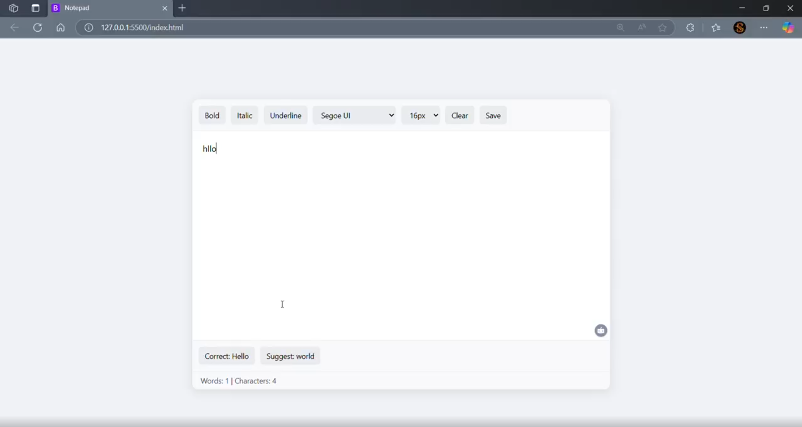

# Notepad Web App 📝

A modern, lightweight notepad web application built with HTML, CSS, and JavaScript. This app features real-time text formatting, autocorrect, and autosuggestion capabilities, providing a seamless writing experience. Perfect for quick notes or creative writing on the go! ✨

## Features 🚀

- **Text Formatting**: Apply bold, italic, and underline styles with a single click.
- **Font Customization**: Choose from multiple fonts (Segoe UI, Arial, Times New Roman, Courier New) and font sizes (16px to 24px).
- **Real-Time Autocorrect**: Automatically corrects misspelled words as you type, powered by an external API.
- **Autosuggestion**: Suggests the next word based on your input, enhancing writing flow.
- **Word & Character Count**: Displays real-time word and character counts in the status bar.
- **Save Functionality**: Download your notes as a `.txt` file with one click.
- **Responsive Design**: Optimized for both desktop and mobile devices.
- **Clean UI**: Minimalistic and user-friendly interface with a professional look.

## Tech Stack 🛠️

- **HTML5**: Structure of the web app.
- **CSS3**: Styling with responsive design and modern aesthetics.
- **JavaScript**: Core functionality, including text formatting, API integration, and event handling.
- **External API**: Integrates with a local API (`http://localhost:11434/api/chat`) for autocorrect and autosuggestion using the `gemma2:2b` model.

## Installation & Setup ⚙️

### Prerequisites
- A modern web browser (Chrome, Firefox, Edge, etc.).
- A local server running the autocorrect and autosuggestion API at `http://localhost:11434/api/chat` (e.g., using a model like `gemma2:2b`).
- Node.js or any static file server (optional for local hosting).

### Steps
1. **Clone the Repository**:
   ```bash
   git clone https://github.com/Shamik004/Intelligent-Notepad.git
   cd Intelligent-Notepad
   ```

2. **Serve the Application**:
   - Option 1: Open `index.html` directly in a browser (note: API features require a server).
   - Option 2: Use a local server (e.g., with Node.js):
     ```bash
     npm install -g http-server
     http-server .
     ```
     Access the app at `http://localhost:8080`.

3. **Set Up the API**:
   - Ensure the autocorrect and autosuggestion API is running locally at `http://localhost:11434/api/chat`.
   - Configure the API to use the `gemma2:2b` model or a compatible alternative.
   - Update the API endpoint in the JavaScript code if necessary.

4. **Test the App**:
   - Open the app in your browser.
   - Start typing to see autocorrect and autosuggestion in action.
   - Use the toolbar to format text, change fonts, or save your notes.

## Usage 📚

- **Formatting**: Use the toolbar buttons to apply bold, italic, or underline styles.
- **Font & Size**: Select from the dropdowns to change the font or font size.
- **Autocorrect & Autosuggestion**: As you type, suggestions and corrections appear in the suggestion box at the bottom. Click a button to apply a correction or add a suggested word.
- **Save Notes**: Click the "Save" button to download your text as a `.txt` file.
- **Clear Text**: Click the "Clear" button to reset the textarea.

## Screenshots 📸


*Caption: The Notepad app with autocorrect and autosuggestion in action.*

## Contributing 🤝

Contributions are welcome! To contribute:
1. Fork the repository.
2. Create a new branch (`git checkout -b feature/your-feature`).
3. Make your changes and commit (`git commit -m "Add your feature"`).
4. Push to the branch (`git push origin feature/your-feature`).
5. Open a pull request.

Please ensure your code follows the project's coding style and includes relevant tests.

## Acknowledgments 🙏

- **AI Wallah**: For invaluable guidance and support during the development of this project.
- The open-source community for inspiration and tools.

## License 📜

This project is licensed under the MIT License. See the [LICENSE](LICENSE) file for details.

## Contact 📬

Feel free to reach out for questions or feedback:
- GitHub: [Shamik004](https://github.com/Shamik004)
- LinkedIn: [Shamik Bardhan](https://www.linkedin.com/in/shamik-bardhan/)

Happy writing! ✍️
